# AI Game Plan API - Fresh Data Fix

## Problem
The `/api/schedules/ai-game-plan` endpoint was reading stale game data from the database `schedules.lastResult` field, which contained games from "this weekend" instead of today's actual games.

## Solution
Modified the API to fetch fresh game data directly from The Rail Media API, just like the `/api/schedules/execute` endpoint does.

## Files Modified

### `/src/app/api/schedules/ai-game-plan/route.ts`

**Changes Made:**

1. **Added imports:**
   - `inArray` from drizzle-orm
   - `findMany` from db-helpers

2. **Added new function `fetchFreshGamesFromRailMedia()`:**
   - Replicates the `searchForGames()` logic from `/api/schedules/execute/route.ts`
   - Fetches today's games directly from The Rail Media API
   - Filters games by channel presets (cable and DirecTV)
   - Removes games that started more than 2 hours ago
   - Tags games that match configured home teams

3. **Updated GET handler:**
   - Removed dependency on stale `lastResult` field
   - Now calls `fetchFreshGamesFromRailMedia()` for fresh game data
   - Uses fresh game data for all calculations and filtering
   - Returns fresh games in both `games` and `upcomingGames` arrays

4. **Enhanced response:**
   - Added `dataSource: "The Rail Media API (Fresh)"` field
   - Added `fetchedAt` timestamp
   - Updated `gamesFound` to reflect fresh game count
   - Updated `summary.totalGames` to reflect fresh game count

## How It Works

```mermaid
graph LR
    A[GET /api/schedules/ai-game-plan] --> B[Load Home Teams]
    B --> C[Fetch from Rail Media API]
    C --> D[Load Channel Presets]
    D --> E[Parse Game Listings]
    E --> F[Filter by Channels]
    F --> G[Filter Old Games]
    G --> H[Tag Home Team Games]
    H --> I[Get Current Device States]
    I --> J[Enrich with ESPN Live Data]
    J --> K[Return Fresh Games]
```



## Data Flow

1. **Home Teams:** Load configured home teams from database
2. **Fresh Games:** Fetch today's games from The Rail Media API (`/api/sports-guide` with `days: 1`)
3. **Channel Filtering:** Only include games on channels configured in channel presets
4. **Staleness Filter:** Remove games that started more than 2 hours ago
5. **Home Team Tagging:** Mark games involving configured home teams
6. **Current State:** Read what's actually playing on each cable box input
7. **ESPN Enrichment:** Add live scores, clock, and game status from ESPN API
8. **Response:** Return all fresh data to frontend

## Testing

### Before Fix:
```json
{
  "success": true,
  "gamesFound": 8,
  "dataSource": undefined,
  "summary": {
    "totalGames": 8,
    "leagues": ["NFL Football", "NBA Basketball"]
  }
}
```
(Games were from "this weekend" - stale data)

### After Fix:
```json
{
  "success": true,
  "dataSource": "The Rail Media API (Fresh)",
  "fetchedAt": "2025-11-24T18:05:28.999Z",
  "gamesFound": 49,
  "summary": {
    "totalGames": 49,
    "homeTeamGames": 0,
    "leagues": [
      "NBA Basketball",
      "NCAA Basketball – Men's",
      "NFL Football",
      "NCAA Football",
      "NHL Hockey",
      "Soccer",
      "Other Sports"
    ]
  }
}
```
(Games are from TODAY - fresh data)

## Log Output

```
[AI_GAME_PLAN] Fetching fresh game data from The Rail Media API
[AI_GAME_PLAN] Fetching fresh games from The Rail Media API for 0 home teams
[AI_GAME_PLAN] Loaded 19 cable channels and 19 DirecTV channels from presets
[AI_GAME_PLAN] Found 56 total games in sports guide
[AI_GAME_PLAN] Filtered out 7 games that started more than 2 hours ago
[AI_GAME_PLAN] Returning 49 games (0 home team games)
[AI_GAME_PLAN] Fetched 49 fresh games from Rail Media API
[AI_GAME_PLAN] Fetching live ESPN data for assigned games
```

## Benefits

1. **Always Fresh:** Games are fetched on-demand from The Rail Media API
2. **Consistent:** Uses same logic as the scheduler execute endpoint
3. **Accurate:** Shows what will actually be scheduled, not what was scheduled days ago
4. **Real-time:** Reflects current game availability and channel assignments
5. **Transparent:** Response clearly indicates data source and fetch time

## Deployment

```bash
# Rebuild and restart (already completed)
npm run build
pm2 restart sports-bar-tv-controller
```

## API Response Structure

```typescript
{
  success: boolean
  scheduleName: string
  lastExecuted: string | null
  gamesFound: number           // Fresh game count
  channelsSet: number          // Currently assigned games
  dataSource: string           // "The Rail Media API (Fresh)"
  fetchedAt: string            // ISO timestamp
  games: Array<{               // Games currently on TVs
    league: string
    homeTeam: string
    awayTeam: string
    gameTime: string
    startTime: string
    channelNumber: string
    cableChannel: string
    directvChannel: string
    venue: string
    isHomeTeamGame: boolean
    liveData: {                // From ESPN
      homeScore: number
      awayScore: number
      clock: string
      period: number
      statusState: string
      statusDetail: string
      isLive: boolean
      isCompleted: boolean
    } | null
  }>
  upcomingGames: Array<Game>   // Fresh games not yet assigned
  summary: {
    totalGames: number
    homeTeamGames: number
    inputsWithGames: number
    upcomingCount: number
    leagues: string[]
  }
}
```

## Related Files

- `/src/app/api/schedules/execute/route.ts` - Original implementation of fresh game fetching
- `/src/app/api/sports-guide/route.ts` - The Rail Media API wrapper
- `/src/lib/sportsGuideApi.ts` - The Rail Media API client
- `/src/db/schema.ts` - Database schema (schedules table)

## Notes

- The database `schedules.lastResult` field is still updated by the scheduler but is no longer used as the primary data source for the UI
- This change only affects the `/api/schedules/ai-game-plan` GET endpoint (used by bartender UI)
- The scheduler execution logic (`/api/schedules/execute`) already uses fresh data and was not modified
