# Update Process & Data Persistence Guide

## 🎯 Quick Answer: Do I Need to Manually Restore Settings?

**NO - Settings persist automatically during normal updates!**

Your database file (`prisma/dev.db`) is protected by `.gitignore` and will **never** be overwritten by `git pull`. When you run the update script, your configurations stay intact automatically.

---

## 📊 How Data Persistence Works

### Protected Files (Never Overwritten by Git)

The following files are in `.gitignore` and persist automatically:

```
✅ prisma/dev.db              # Your entire database (all settings)
✅ prisma/dev.db-journal      # Database transaction log
✅ .env                       # API keys and secrets
✅ config/*.local.json        # Local configuration overrides
✅ data/*.json                # Subscriptions, credentials, device configs
✅ data/scene-logs/           # Scene execution history
✅ data/atlas-configs/*.json  # Atlas matrix configurations
```

### What This Means

When you run `./update_from_github.sh`:
1. **Git pulls new code** - Only code files are updated
2. **Your database stays untouched** - All your settings remain
3. **Migrations add new features** - Without deleting existing data
4. **Application restarts** - With all your configurations intact

---

## 🔄 Normal Update Workflow (No Manual Restore Needed)

```mermaid
graph TD
    A[Run ./update_from_github.sh] --> B[Automatic Backup Created]
    B --> C[Git Pull Latest Code]
    C --> D[Database File Protected by .gitignore]
    D --> E[Run Database Migrations]
    E --> F{Migration Type}
    F -->|Add New Tables/Columns| G[Existing Data Preserved]
    F -->|Schema Changes| G
    G --> H[Rebuild Application]
    H --> I[Restart with PM2]
    I --> J[✅ All Settings Intact!]
    
    style D fill:#90EE90
    style G fill:#90EE90
    style J fill:#90EE90
```



### Step-by-Step: What Happens During Update

1. **Backup Created** (Safety Net)
   - Full backup saved to `~/sports-bar-backups/`
   - Includes database, config files, and data files
   - Timestamp: `config-backup-YYYYMMDD-HHMMSS.tar.gz`

2. **Code Update** (Git Pull)
   - New features and bug fixes downloaded
   - **Your database file is NOT touched** (protected by .gitignore)
   - Only code files are updated

3. **Database Migrations** (Schema Updates)
   - Migrations use `ALTER TABLE` commands (not `DROP TABLE`)
   - New tables/columns are **added** to existing database
   - Your existing data remains untouched
   - Example migration:
     ```sql
     -- Adds new feature without deleting data
     CREATE TABLE "AIGainConfiguration" (...)
     ALTER TABLE "AudioInputMeter" ADD COLUMN "newFeature" TEXT
     ```

4. **Application Restart**
   - PM2 gracefully restarts the server
   - Connects to your existing database
   - All settings load automatically

5. **Result**
   - ✅ All TV configurations preserved
   - ✅ All matrix routes intact
   - ✅ All audio settings maintained
   - ✅ All schedules active
   - ✅ All API keys working
   - ✅ All home teams configured

---

## 🔍 How to Verify Settings Persisted

After updating, verify your data is intact:

### Check Database Exists
```bash
ls -lh /home/ubuntu/Sports-Bar-TV-Controller/prisma/dev.db
```
**Expected:** File exists with recent timestamp

### Check Database Contents
```bash
cd /home/ubuntu/Sports-Bar-TV-Controller
npx prisma studio
```
**Expected:** Opens database browser showing all your configurations

### Check Specific Configurations
```bash
# View matrix configurations
sqlite3 prisma/dev.db "SELECT name, ipAddress FROM MatrixConfiguration;"

# View TV outputs
sqlite3 prisma/dev.db "SELECT label, channelNumber FROM MatrixOutput LIMIT 5;"

# View schedules
sqlite3 prisma/dev.db "SELECT name, enabled FROM Schedule;"

# View home teams
sqlite3 prisma/dev.db "SELECT teamName, league FROM HomeTeam;"
```

### Check Application
1. Open web interface: `http://localhost:3000`
2. Navigate to Settings → Matrix Configuration
3. Verify your TVs and inputs are listed
4. Check Schedules page for your automated tasks
5. Verify Sports Guide shows your home teams

---

## 🛡️ When Backups Are Actually Used

Backups are your **safety net** for rare scenarios:

### Scenario 1: Migration Failure (Rare)
**What happened:** Database migration encountered an error and corrupted the database

**Symptoms:**
- Application won't start
- Database errors in logs
- Missing tables or columns

**Solution:** Restore from backup
```bash
./restore_backup.sh
# Select the backup from before the update
```

### Scenario 2: Accidental Data Deletion
**What happened:** You accidentally deleted important configurations

**Examples:**
- Deleted all TV outputs by mistake
- Removed critical schedules
- Cleared home team list

**Solution:** Restore from backup
```bash
./restore_backup.sh
# Select a recent backup with your data
```

### Scenario 3: Testing/Development
**What happened:** You want to test changes without affecting production

**Solution:** Restore to a known good state after testing
```bash
# Make backup before testing
./update_from_github.sh  # Creates automatic backup

# Test your changes...

# Restore if needed
./restore_backup.sh
```

### Scenario 4: Rollback After Update
**What happened:** New update has a bug affecting your setup

**Solution:** Restore previous version
```bash
./restore_backup.sh
# Select backup from before the problematic update
```

---

## ❌ When Manual Restore is NOT Needed

You do **NOT** need to restore from backup in these common situations:

### ✅ Normal Updates
- Running `./update_from_github.sh` regularly
- Pulling latest features and bug fixes
- Database migrations that add new features

### ✅ Application Restarts
- PM2 restarts after crashes
- Manual restarts with `pm2 restart`
- Server reboots (PM2 auto-starts on boot)

### ✅ Code Changes
- Updating Next.js components
- Modifying UI elements
- Adding new API endpoints

### ✅ Configuration Changes via UI
- Adding/editing TV outputs
- Creating new schedules
- Updating matrix routes
- Changing audio settings

**Why?** All these changes are saved to the database file, which persists automatically.

---

## 📋 Complete Update Checklist

### Before Update
- [ ] Application is running normally
- [ ] No critical operations in progress
- [ ] (Optional) Note current version/commit

### During Update
```bash
cd /home/ubuntu/Sports-Bar-TV-Controller
./update_from_github.sh
```

The script automatically:
- [x] Creates backup
- [x] Stops PM2 process
- [x] Pulls latest code
- [x] Installs dependencies
- [x] Runs migrations
- [x] Rebuilds application
- [x] Restarts PM2 process

### After Update
- [ ] Check application is running: `pm2 status`
- [ ] Access web interface: `http://localhost:3000`
- [ ] Verify key settings (TVs, schedules, etc.)
- [ ] Check logs if needed: `pm2 logs sports-bar-tv-controller`

### If Something Goes Wrong
```bash
# View recent backups
ls -lh ~/sports-bar-backups/

# Restore from backup
./restore_backup.sh
```

---

## 🔧 Understanding Database Migrations

### What Are Migrations?

Migrations are SQL scripts that update your database schema to support new features. They are designed to be **additive** and **non-destructive**.

### Migration Types

#### ✅ Safe Migrations (Most Common)
```sql
-- Add new table
CREATE TABLE "NewFeature" (...)

-- Add new column to existing table
ALTER TABLE "MatrixOutput" ADD COLUMN "newSetting" TEXT

-- Add index for performance
CREATE INDEX "idx_name" ON "Table"("column")
```
**Result:** Existing data is preserved, new features are added

#### ⚠️ Potentially Disruptive Migrations (Rare)
```sql
-- Rename column (data preserved but structure changes)
ALTER TABLE "Table" RENAME COLUMN "oldName" TO "newName"

-- Change column type (may require data conversion)
-- SQLite handles this by creating new table and copying data
```
**Result:** Data is preserved but may be transformed

#### ❌ Destructive Migrations (Never Used)
```sql
-- Drop table (would delete all data)
DROP TABLE "ImportantData"

-- Drop column (would delete data in that column)
ALTER TABLE "Table" DROP COLUMN "importantData"
```
**Result:** These are **never** used in this project. If a feature is removed, the table/column is left in place for backward compatibility.

### How Migrations Preserve Your Data

1. **Additive Design**
   - New features add new tables/columns
   - Old data remains untouched
   - Backward compatible

2. **Default Values**
   - New columns have sensible defaults
   - Existing rows automatically get default values
   - No manual data entry required

3. **Foreign Key Preservation**
   - Relationships between tables maintained
   - Cascade rules protect data integrity
   - Orphaned records prevented

### Example: Real Migration from This Project

```sql
-- Migration: 20251002231714_ai_input_gain_control
-- Adds AI gain control feature without affecting existing audio setup

-- Creates new table for AI feature
CREATE TABLE "AIGainConfiguration" (
    "id" TEXT NOT NULL PRIMARY KEY,
    "inputMeterId" TEXT NOT NULL,
    "aiEnabled" BOOLEAN NOT NULL DEFAULT false,
    -- ... more columns
    CONSTRAINT "AIGainConfiguration_inputMeterId_fkey" 
        FOREIGN KEY ("inputMeterId") 
        REFERENCES "AudioInputMeter" ("id") 
        ON DELETE CASCADE ON UPDATE CASCADE
);
```

**What This Does:**
- ✅ Adds new AI gain control feature
- ✅ Links to existing AudioInputMeter table
- ✅ Defaults to disabled (aiEnabled = false)
- ✅ Your existing audio settings unchanged
- ✅ You can enable AI gain control when ready

---

## 🗂️ Backup System Details

### Automatic Backup Creation

Backups are created automatically:
- **Before every update** when running `./update_from_github.sh`
- **Before database migrations** to protect against migration failures

### Backup Contents

Each backup includes:

1. **Database File** (`prisma/dev.db`)
   - All configurations
   - All user data
   - All schedules and logs

2. **Configuration Files**
   - `.env` - API keys and secrets
   - `config/*.local.json` - Local overrides
   - `data/*.json` - Subscriptions and credentials

3. **Data Directories**
   - `data/scene-logs/` - Scene execution history
   - `data/atlas-configs/` - Atlas matrix configs

4. **SQL Dump** (Separate File)
   - Portable SQL format
   - Can be imported to any SQLite database
   - Located in `database-backups/` subdirectory

### Backup Location

```
~/sports-bar-backups/
├── config-backup-20251003-120000.tar.gz  # Full backup (most recent)
├── config-backup-20251002-180000.tar.gz  # Previous backup
├── config-backup-20251001-150000.tar.gz  # Older backup
├── ...
├── database-backups/
│   ├── dev-db-20251003-120000.sql.gz     # SQL dump (most recent)
│   ├── dev-db-20251002-180000.sql.gz     # Previous SQL dump
│   └── ...
└── backup-manifest-20251003-120000.txt   # Backup details
```

### Retention Policy

- **Configuration Backups:** Last 7 kept (older auto-deleted)
- **SQL Dumps:** Last 10 kept (older auto-deleted)
- **Manifests:** Kept with corresponding backups

### Backup Size

Typical backup sizes:
- **Configuration backup:** 50-200 KB (compressed)
- **SQL dump:** 100-500 KB (compressed)
- **Total storage:** ~2-5 MB for all retained backups

---

## 🚨 Troubleshooting

### Issue: "Database is locked"

**Cause:** Application is still running while trying to backup/restore

**Solution:**
```bash
pm2 stop sports-bar-tv-controller
# Then retry your operation
pm2 start sports-bar-tv-controller
```

### Issue: "Migration failed"

**Cause:** Database schema conflict or corruption

**Solution:**
```bash
# Restore from backup
./restore_backup.sh

# If that doesn't work, check logs
pm2 logs sports-bar-tv-controller --lines 100
```

### Issue: "Settings disappeared after update"

**Cause:** This should never happen, but if it does:

**Diagnosis:**
```bash
# Check if database file exists
ls -lh prisma/dev.db

# Check database contents
npx prisma studio
```

**Solution:**
```bash
# Restore from most recent backup
./restore_backup.sh
```

### Issue: "Can't find backup files"

**Cause:** Backups not created or wrong directory

**Solution:**
```bash
# Check backup directory
ls -lh ~/sports-bar-backups/

# If empty, backups weren't created
# Run update script to create first backup
./update_from_github.sh
```

---

## 📚 Related Documentation

- **[BACKUP_RESTORE_GUIDE.md](./BACKUP_RESTORE_GUIDE.md)** - Detailed backup/restore procedures
- **[README.md](./README.md)** - Installation and setup instructions
- **Update Script:** `./update_from_github.sh` - Automated update process
- **Restore Script:** `./restore_backup.sh` - Interactive restore tool

---

## 💡 Best Practices

### Regular Updates
- Update weekly or when new features are announced
- Read release notes before updating
- Update during low-traffic periods

### Backup Verification
- Occasionally verify backups are being created
- Check backup directory size: `du -sh ~/sports-bar-backups/`
- Test restore process in development environment

### Monitoring
- Check PM2 status regularly: `pm2 status`
- Review logs for errors: `pm2 logs sports-bar-tv-controller`
- Monitor disk space: `df -h`

### Documentation
- Keep notes of custom configurations
- Document any manual changes to database
- Track which features you're actively using

---

## 🎓 Summary

### Key Takeaways

1. **Settings persist automatically** - Your database file is protected by `.gitignore`
2. **Backups are safety nets** - For rare failures, not routine updates
3. **Migrations are additive** - They add features without deleting data
4. **No manual restore needed** - For normal updates and restarts
5. **Restore only when needed** - Migration failures, accidental deletions, or rollbacks

### When to Restore vs When Not To

| Situation | Restore Needed? | Why |
|-----------|----------------|-----|
| Normal update | ❌ No | Database persists automatically |
| Application restart | ❌ No | Database file unchanged |
| PM2 crash recovery | ❌ No | Database file unchanged |
| Server reboot | ❌ No | Database file unchanged |
| Migration failure | ✅ Yes | Database may be corrupted |
| Accidental deletion | ✅ Yes | Need to recover lost data |
| Testing rollback | ✅ Yes | Return to known good state |
| Update causes bugs | ✅ Yes | Rollback to previous version |

### Quick Reference Commands

```bash
# Normal update (no restore needed)
./update_from_github.sh

# Check application status
pm2 status

# View logs
pm2 logs sports-bar-tv-controller

# List available backups
ls -lh ~/sports-bar-backups/

# Restore from backup (only if needed)
./restore_backup.sh

# Verify database
npx prisma studio
```

---

**Questions?** Check the [BACKUP_RESTORE_GUIDE.md](./BACKUP_RESTORE_GUIDE.md) for detailed restore procedures, or review the update script source code for technical details.
