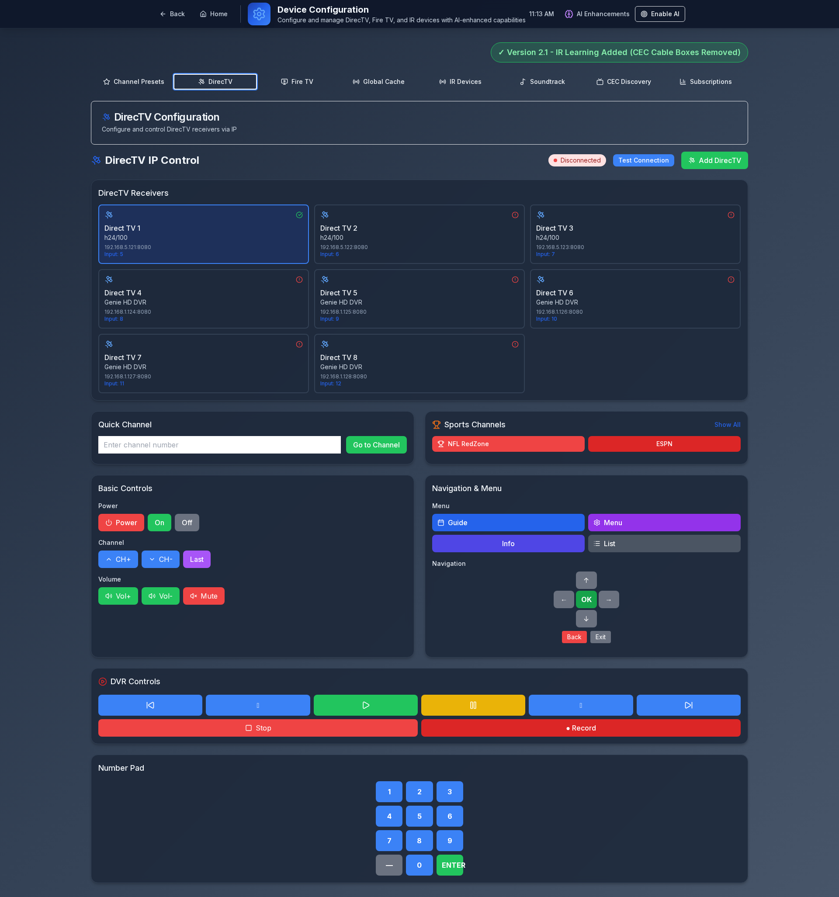
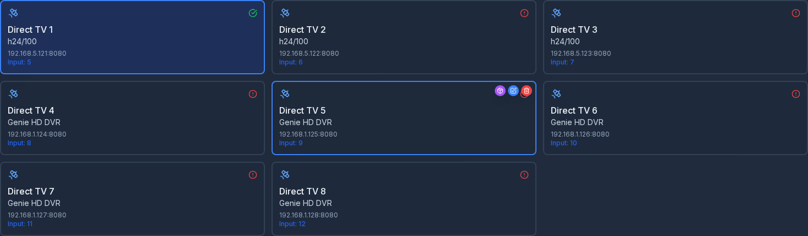
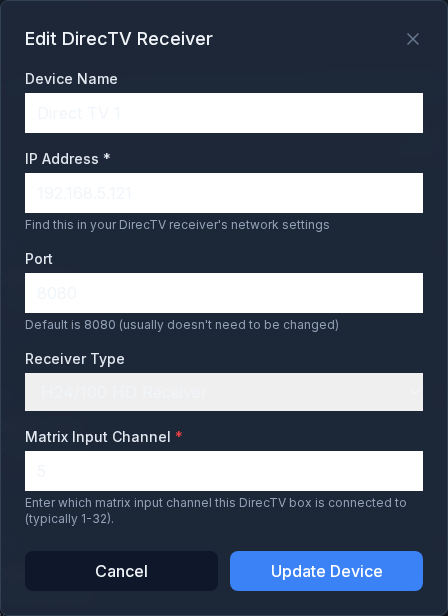
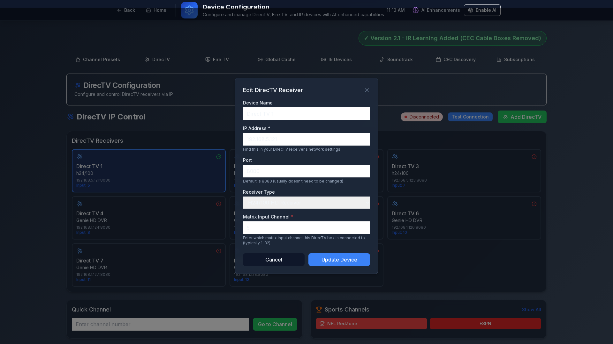

# DirecTV Edit Modal - UI Test Results

**Test Date:** November 19, 2025
**Component:** DirecTV Device Configuration Edit Modal
**Status:** ⚠️ Issues Identified - Fixes Required

---

## Quick Summary

Automated UI testing of the DirecTV device edit modal identified **13 issues** that need to be addressed:

- 🔴 **11 High-Severity Accessibility Issues** - Low contrast helper text (WCAG failure)
- 🔴 **2 Critical CSS Errors** - Invalid "or" keyword in button className
- 🟢 **Modal Functionality** - Working correctly

**Estimated Fix Time:** 30-60 minutes
**Files Affected:** 1 file (`DirecTVController.tsx`)
**Lines of Code to Change:** 5 lines

---

## Documentation Files

### 1. Test Summary Report
**File:** `TEST_SUMMARY.md`
**Description:** Comprehensive test report with detailed findings, code locations, WCAG compliance analysis, and recommendations.

**Contents:**
- Executive summary
- Screenshot descriptions
- Accessibility issues with WCAG references
- CSS error details with code examples
- Code locations and line numbers
- Testing methodology
- Prioritized recommendations

### 2. Visual Issues Guide
**File:** `VISUAL_ISSUES_GUIDE.md`
**Description:** Step-by-step visual guide showing exactly what's wrong and how to fix it.

**Contents:**
- Visual examples of each issue
- Before/after code comparisons
- Quick fix instructions
- Testing checklist
- Related issues in other files

### 3. Test Report (JSON)
**File:** `test-report.json`
**Description:** Machine-readable test results for automated processing.

**Contents:**
- List of captured screenshots
- Accessibility issues array
- CSS errors array
- Connection status data
- Test metadata (timestamp, duration)

---

## Screenshot Gallery

### Device List View
**File:** `directv-device-list.png` (584 KB)



Shows all 8 DirecTV receivers in grid layout with connection status indicators.

---

### Card Hover State
**File:** `directv-card-hover-state.png` (50 KB)



Edit and delete buttons appear on hover.

---

### Edit Modal - Full Page
**File:** `directv-edit-modal-full.png` (291 KB)


Modal overlay with device list in background.

---

### Edit Modal - Dialog
**File:** `directv-edit-modal-dialog.png` (33 KB)



**Issues Visible:**
- Helper text is barely visible (gray on dark background)
- Cancel button contains CSS syntax error

---

### Cancel Button Close-Up
**File:** `directv-cancel-button.png` (1.5 KB)


Button with invalid CSS: `bg-slate-800 or bg-slate-900`

---

### Offline Device Modal
**File:** `directv-edit-offline-device.png` (291 KB)



Edit modal for Direct TV 2 (offline).

---

## Key Issues Identified

### Issue 1: Low Contrast Helper Text ⚠️
**Severity:** HIGH
**WCAG:** 1.4.3 Contrast (Minimum) - FAIL

Helper text uses `text-slate-400` which is too dark to read on the modal background.

**Affected Elements:**
- IP Address helper text
- Port helper text
- Matrix Input Channel helper text

**Fix:** Change `text-slate-400` → `text-slate-300` (3 lines)

---

### Issue 2: Invalid CSS Syntax 🔴
**Severity:** CRITICAL
**Impact:** Code quality, maintainability

Cancel button className contains invalid "or" keyword:
```tsx
className="flex-1 bg-slate-800 or bg-slate-900 ..."
```

**Fix:** Remove `or bg-slate-900` (1 line)

---

### Issue 3: Missing ARIA Labels 🟡
**Severity:** MEDIUM
**WCAG:** 4.1.2 Name, Role, Value - PARTIAL

Form inputs not properly linked to labels.

**Fix:** Add `htmlFor`, `id`, `aria-required`, `aria-describedby` attributes (optional enhancement)

---

## Files to Fix

### Primary File
**Path:** `/home/ubuntu/Sports-Bar-TV-Controller/src/components/DirecTVController.tsx`

**Lines to Change:**
- Line 1101: Helper text contrast
- Line 1112: Helper text contrast
- Line 1154: Helper text contrast
- Line 1162: Cancel button CSS error

### Related File
**Path:** `/home/ubuntu/Sports-Bar-TV-Controller/src/components/EnhancedDirecTVController.tsx`

**Lines to Change:**
- Line 147: Same "or" pattern in severity color function

---

## How to Apply Fixes

### Quick Fix (5 minutes)
1. Open `/src/components/DirecTVController.tsx`
2. Find lines 1101, 1112, 1154
3. Replace `text-slate-400` with `text-slate-300`
4. Find line 1162
5. Replace `bg-slate-800 or bg-slate-900` with `bg-slate-800`
6. Replace `hover:bg-gray-300` with `hover:bg-slate-700`
7. Save and test

### Full Fix with ARIA (30 minutes)
Follow the detailed instructions in `VISUAL_ISSUES_GUIDE.md`

---

## Testing After Fixes

### Automated Re-Test
```bash
cd /home/ubuntu/Sports-Bar-TV-Controller
npx tsx scripts/capture-directv-edit-complete.ts
```

**Expected Results:**
- Accessibility issues: 0 (down from 11)
- CSS errors: 0 (down from 2)
- All screenshots show improved contrast

### Manual Testing Checklist
- [ ] Helper text is clearly visible
- [ ] No CSS errors in browser console
- [ ] Cancel button hover effect works
- [ ] Screen reader announces labels correctly
- [ ] Focus indicators are visible
- [ ] All form fields are functional

### Contrast Testing
Use WebAIM Contrast Checker: https://webaim.org/resources/contrastchecker/

**Target Ratios:**
- Normal text (12px): 4.5:1 or higher
- Large text (18px+): 3:1 or higher

---

## Test Automation

### Test Script
**Location:** `/home/ubuntu/Sports-Bar-TV-Controller/scripts/capture-directv-edit-complete.ts`

**What it does:**
1. Navigates to device config page
2. Clicks DirecTV tab
3. Opens edit modal for Direct TV 1
4. Captures 6 screenshots
5. Analyzes accessibility issues
6. Detects CSS errors
7. Generates JSON report
8. Creates summary output

**Run time:** ~12 seconds

### Integration into CI/CD
This script can be added to your CI/CD pipeline to automatically detect UI regressions:

```yaml
# Example GitHub Actions workflow
- name: Run UI Tests
  run: npx tsx scripts/capture-directv-edit-complete.ts

- name: Check for Issues
  run: |
    ISSUES=$(jq '.accessibility_issues | length' docs/screenshots/directv-edit-modal/test-report.json)
    if [ "$ISSUES" -gt 0 ]; then
      echo "Found $ISSUES accessibility issues!"
      exit 1
    fi
```

---

## Compliance Status

### WCAG 2.1 Level AA
**Overall Status:** ❌ DOES NOT MEET

| Criterion | Level | Status | Issue |
|-----------|-------|--------|-------|
| 1.4.3 Contrast (Minimum) | AA | ❌ | Helper text fails contrast requirements |
| 2.4.6 Headings and Labels | AA | ⚠️ | Labels present but not linked |
| 4.1.2 Name, Role, Value | A | ⚠️ | Missing ARIA attributes |

**After fixes:** Should meet WCAG 2.1 Level AA standards

---

## Contact

For questions about these test results or assistance with fixes:

- Test script: `/scripts/capture-directv-edit-complete.ts`
- Component: `/src/components/DirecTVController.tsx`
- Documentation: This directory

---

## Version History

**v1.0 - 2025-11-19**
- Initial automated UI test
- Identified 11 accessibility issues
- Identified 2 CSS errors
- Created comprehensive documentation
- Generated 6 screenshots

---

*Automated UI testing by Playwright UI Testing Specialist*
*Sports Bar TV Controller - Device Configuration Module*
